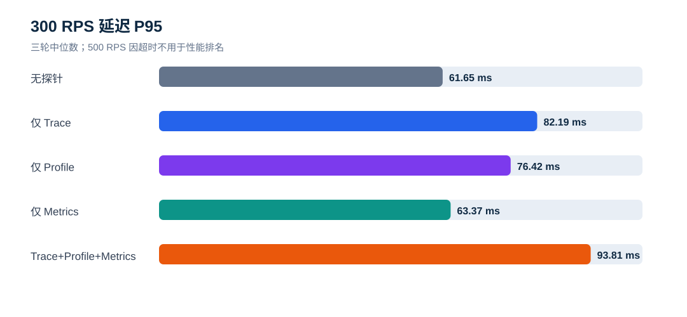

# ddtrace Trace / Profile / Metrics K6 专项压测报告

**执行日期：** 2026-09-16  
**测试对象：** 观测云 ddtrace Java Agent 与无探针基线  
**资源口径：** 5 台隔离节点，全部 4C8G、100 GiB ESSD PL0  
**正式窗口：** 5 种模式 × 3 个负载档 × 3 轮 = **45 个**，每轮 90 秒  

## 先看结论

1. **300 RPS 是本次 4C8G 业务模型的有效稳定档。** 无探针、仅 Trace、仅 Profile、仅 Metrics、三类全开共 15 个 300 RPS 窗口全部完成约 27,000 次请求，HTTP 失败和 K6 dropped iterations 均为 0。
2. **三类全开在 300 RPS 可用，但存在可量化开销。** 相对无探针三轮中位数，平均延迟从 38.37 ms 增至 45.37 ms（+18.3%），P95 从 61.65 ms 增至 93.81 ms（+52.2%），CPU 秒/千成功请求增加 +11.2%，RSS P95 增加 +24.5%。
3. **单项开销中 Metrics 最轻。** 300 RPS 下 Metrics-only 平均延迟 38.79 ms、P95 63.37 ms，CPU 秒/千请求仅比基线高 +0.9%。Trace-only 和 Profile-only 的 P95 分别为 82.19 ms 与 76.42 ms。
4. **100/300 RPS 下未发现综合模式的 Trace 队列丢失。** 三轮均满足 Agent 创建=入队=flush、发送请求=响应、明确丢弃=0；Profile 每窗均成功上传；JVM Metrics 每窗至少 35 个指标族且 UDP 解码错误为 0。
5. **500 RPS 不能作为可承载结论。** 各模式都发出约 45,000 次请求，但约 24.5% 超时，成功量中位数约 33,973。观测云 K6 明细显示主要为错误码 1050（请求 30 秒超时），少量 1211（TCP 建连超时）。500 RPS 是应用/业务模型压力边界，不是 Agent 的稳定容量档。
6. **500 RPS 下存在明确 Trace 丢失。** 三类全开 3 轮分别丢弃 19,137, 8,935, 18,424 条 Trace；Trace-only 的 DataKit 接收包也降至 15,673–18,511，明显低于约 34,000 个成功业务请求。该现象发生在应用已经大量超时的无效压力档。
7. **K6 指标已接入观测云并可按窗口回溯。** `k6` measurement 中发现 45 个唯一 `testid`，与 45 个正式窗口完全对应；抽查 `all-normal-r300-rep3` 得到 27,001 请求、失败率 0、P95 89.229879 ms，与本地汇总一致。

## CPU 与内存影响

这里的 **CPU 总消耗** 是 Java 应用进程在 90 秒主压及异步排空期间累计使用的 CPU core-seconds；它包含 Agent 序列化、队列发送和停机前排空成本。**RSS P95** 是同一 Java 进程的常驻内存第 95 百分位。两项都只统计应用节点上的 Java 进程，不包含 K6、DataKit、MySQL/Redis 或监控节点。

### 300 RPS 稳定档

| 模式 | CPU 总消耗 | CPU 增量 | CPU 增幅 | RSS P95 | 内存增量 | 内存增幅 |
|---|---:|---:|---:|---:|---:|---:|
| 无探针 | 246.64 CPU-s | +0.00 CPU-s | +0.0% | 595.0 MiB | +0.0 MiB | +0.0% |
| 仅 Trace | 266.67 CPU-s | +20.03 CPU-s | +8.1% | 666.9 MiB | +71.9 MiB | +12.1% |
| 仅 Profile | 252.71 CPU-s | +6.07 CPU-s | +2.5% | 697.2 MiB | +102.2 MiB | +17.2% |
| 仅 Metrics | 248.87 CPU-s | +2.23 CPU-s | +0.9% | 629.4 MiB | +34.4 MiB | +5.8% |
| Trace+Profile+Metrics | 274.25 CPU-s | +27.61 CPU-s | +11.2% | 740.8 MiB | +145.8 MiB | +24.5% |

在最接近生产完整开启的三类全开模式下，300 RPS 相对无探针增加 **27.61 CPU-s（+11.2%）** 和 **145.8 MiB RSS（+24.5%）**。在 4C8G 应用节点上，RSS P95 从约 7.3% 的物理内存增加至约 9.0%；内存容量仍有余量，但这不包含操作系统页缓存和其他进程。

### 100 RPS 低负载档

| 模式 | CPU 总消耗 | CPU 增量 | CPU 增幅 | RSS P95 | 内存增量 | 内存增幅 |
|---|---:|---:|---:|---:|---:|---:|
| 无探针 | 81.16 CPU-s | +0.00 CPU-s | +0.0% | 582.1 MiB | +0.0 MiB | +0.0% |
| 仅 Trace | 89.33 CPU-s | +8.17 CPU-s | +10.1% | 647.3 MiB | +65.1 MiB | +11.2% |
| 仅 Profile | 85.19 CPU-s | +4.03 CPU-s | +5.0% | 648.8 MiB | +66.6 MiB | +11.4% |
| 仅 Metrics | 81.92 CPU-s | +0.76 CPU-s | +0.9% | 604.9 MiB | +22.8 MiB | +3.9% |
| Trace+Profile+Metrics | 92.83 CPU-s | +11.67 CPU-s | +14.4% | 721.2 MiB | +139.1 MiB | +23.9% |

100 RPS 下三类全开相对无探针增加 **11.67 CPU-s（+14.4%）** 和 **139.1 MiB RSS（+23.9%）**。低负载时 Agent 的固定成本占比更高，因此 CPU 增幅略高于 300 RPS。

## 一、背景与目标

本轮只测试观测云 ddtrace，不再测试 SkyWalking。目标是把 Agent 的三类能力拆开测量，再验证三类同时开启时的综合开销：

- `baseline`：无探针；
- `trace`：仅 Trace，关闭 Profile、JMXFetch 和 runtime metrics；
- `profile`：仅 Profile，关闭 Trace 和 Metrics；
- `metrics`：仅 JMXFetch/runtime metrics，关闭 Trace 和 Profile；
- `all`：Trace、Profile、Metrics 同时开启。

同时验证 K6 Prometheus Remote Write 是否能经 DataKit 进入观测云，并能用 `benchmark_id` 和 `testid` 回溯单个窗口。

## 二、资源与部署架构

| 节点 | 数量 | 规格 | 职责 |
|---|---:|---|---|
| K6 | 1 | 4C8G / 100 GiB | 业务流量、K6 Remote Write |
| 应用 | 1 | 4C8G / 100 GiB | 同一 Java 应用；按模式加载 Agent |
| 依赖 | 1 | 4C8G / 100 GiB | MariaDB、Redis |
| Collector | 1 | 4C8G / 100 GiB | DataKit：ddtrace、profile、StatsD、prom_remote_write |
| 监控 | 1 | 4C8G / 100 GiB | DogStatsD 审计/转发、五节点资源采样 |

合计 **5 台、20 vCPU、40 GiB 内存、500 GiB 系统盘**。所有节点位于同一上海可用区和私有网络，角色互相分离。Java 统一使用 Temurin 8u504；Agent 版本为 `1.65.6-ext~a6e99e1de2`。

## 三、步骤与统计口径

每个正式窗口执行：启动新 JVM并计时 → 50 RPS 预热 10 秒 → 等待指标桶切换并清零审计器 → K6 `constant-arrival-rate` 正式施压 90 秒 → 等待业务请求排空 → Trace 模式等待 RemoteWriter 25 秒 → 停止 JVM → Profile 模式再等待 15 秒 → 收集五节点资源、Agent 健康指标、DataKit 输入和日志。

负载顺序按三轮轮换：`100→300→500`、`500→300→100`、`300→500→100`。表格使用三轮中位数，范围保留在 CSV；HTTP 成功、失败、K6 dropped iterations 分开统计。

## 四、业务性能现象

### 4.1 300 RPS 稳定档

| 模式 | 成功请求（中位数） | 平均延迟 | P95 | CPU 秒/千成功请求 | RSS P95 | 启动时间 |
|---|---:|---:|---:|---:|---:|---:|
| 无探针 | 27,001 | 38.37 ms | 61.65 ms | 9.134 | 595.0 MiB | 3128 ms |
| 仅 Trace | 27,001 | 43.32 ms | 82.19 ms | 9.876 | 666.9 MiB | 5225 ms |
| 仅 Profile | 27,000 | 45.29 ms | 76.42 ms | 9.360 | 697.2 MiB | 5177 ms |
| 仅 Metrics | 27,001 | 38.79 ms | 63.37 ms | 9.217 | 629.4 MiB | 4171 ms |
| Trace+Profile+Metrics | 27,001 | 45.37 ms | 93.81 ms | 10.157 | 740.8 MiB | 6232 ms |

300 RPS 下三类全开没有降低业务成功率，但尾延迟和内存增幅比均值更明显。Trace 与 Profile 是主要开销来源；Metrics-only 接近基线。

### 4.2 启动时间

无探针启动中位数 3128 ms；Trace-only 5225 ms，Profile-only 5177 ms，Metrics-only 4171 ms，三类全开 6232 ms。三类全开较无探针增加约 3104 ms。

### 4.3 500 RPS 压力档

500 RPS 三轮均没有 K6 dropped iterations，说明压测端成功发出目标请求；失败来自请求超时。最后一轮综合模式的观测云 K6 分组结果为：33,972 次 HTTP 200、10,937 次 1050 请求超时、92 次 1211 建连超时。K6 官方定义中，1050 是 HTTP request timeout，1211 是 dial timeout。

因此 500 RPS 表示当前应用/依赖/连接处理能力已饱和，不能用于计算健康的探针退化倍率，也不能写成“系统支持 500 RPS”。

## 五、遥测完整性

| 模式 | Trace | Profile | Metrics | 结论 |
|---|---|---|---|---|
| 无探针 | 0 | 0 | 0 | 模式隔离正确；K6 指标仍由独立节点上报 |
| Trace-only | 100/300 RPS 每窗均有 DataKit Span/Trace 增量 | 0 | 0 | 稳定档接收正常；500 RPS 接收显著下降 |
| Profile-only | 0 | 每窗 1–2 个 profile，上传接口均 OK | 0 | 9/9 窗口成功 |
| Metrics-only | 0 | 0 | 每窗 462–715 个 StatsD 点，35 个 JVM 指标族 | 9/9 窗口成功，解码错误 0 |
| 三类全开 | 100/300 RPS 入队=flush、请求=响应、丢弃=0 | 每窗 2–3 个 profile | 每窗 655–860 个 StatsD 点 | 稳定档三条链路同时通过 |

Trace-only 没有队列健康指标是 Agent 1.65.6-ext 的实现限制：源码把 `healthMetricsEnabled` 与 `runtimeMetricsEnabled` 绑定。为保持 Trace-only 纯度，本轮没有为获取队列指标而开启 Metrics。Trace-only 采用 DataKit 接收增量和日志验证；队列级直接证据来自三类全开模式。

500 RPS 的综合模式中，已入队 Trace 最终全部 flush，且发送请求全部收到响应；丢失发生在队列入队阶段，Agent 明确记录 `queue.dropped.traces`。这与“队列没来得及清空”不同，延长等待只能排空已入队数据，不能恢复已经被记录为 dropped 的 Trace。

## 六、K6 指标接入观测云

K6 使用 `experimental-prometheus-rw` 输出到 DataKit `/prom_remote_write`，每个窗口携带：

- `benchmark_id=ddtrace-20260916`
- `testid=<模式>-normal-r<RPS>-rep<轮次>`
- `profile=normal`

观测云 `k6` measurement 已发现请求量、失败率、耗时 avg/P90/P95/P99/max、iterations、VU、收发字节等字段。45 个正式窗口全部有 Remote Write 增量，观测云查询也发现全部 45 个 `testid`。

项目同时提供可导入的 `dashboard/ddtrace-k6-replay.json`，可按 `benchmark_id`、`testid` 筛选回溯请求、失败率和延迟。原始 Owl 查询证据保存在 `owl-reports/`。

## 七、建议

1. 常规容量结论采用 **300 RPS**；500 RPS 仅作为故障/饱和行为探测。
2. 生产启用三类观测时，为应用预留约 **12% CPU 成本、25% JVM RSS 空间**，并为 P95 波动保留余量；该建议只适用于本业务模型和 4C8G 规格。
3. 对高压场景持续监控 `queue.dropped.traces`、`queue.enqueued.traces`、`flush.traces.total` 与 API responses。队列 dropped 大于 0 时应直接判为采集不完整。
4. 需要提升至 500 RPS 时，先定位 30 秒请求超时和 TCP 建连超时：检查应用线程/连接池、监听 backlog、MySQL/Redis 连接池和业务同步等待，再重新测基线；基线通过后才比较 Agent。
5. K6 仪表板长期保留 `benchmark_id` 与 `testid`，正式压测结束后记录绝对时间范围，便于将业务、Agent 与节点指标对齐。

## 八、限制与适用范围

- 结论适用于本次 Java 应用、waterfall 接口、Temurin 8u504、Agent 1.65.6-ext 和单机 4C8G 配置。
- 三轮可判断本次环境的可复现性，不等同于长期稳定性测试；建议对 300 RPS 再执行 30–60 分钟 soak test。
- DataKit 本机计数证明已接收并写入发送链路；观测云 K6 查询证明 Remote Write 可回溯。Trace/Profile 的观测云页面展示可在需要时继续抽查。
- 本轮不比较 SkyWalking，也不对其他 ddtrace 发行版做排名。

## 九、参考资料

- [观测云 ddtrace 集成](https://docs.guance.com/en/integrations/ddtrace/)
- [观测云 Java Profiling](https://docs.guance.com/integrations/profile-java/)
- [观测云 ddtrace JVM Metrics](https://docs.guance.com/en/integrations/ddtrace-jmxfetch/)
- [观测云 Prometheus Remote Write](https://docs.guance.com/en/integrations/prom_remote_write/)
- [Grafana k6 Prometheus Remote Write](https://grafana.com/docs/k6/latest/results-output/real-time/prometheus-remote-write/)
- [Grafana k6 HTTP 错误码](https://grafana.com/docs/k6/latest/javascript-api/error-codes/)

## 十、交付文件

- `data/window-results.csv`：45 个窗口的明细；
- `data/summary.csv`：15 个模式/负载组合的三轮中位数和范围；
- `data/validation.json`：自动完整性校验；
- `dashboard/ddtrace-k6-replay.json`：观测云 K6 回溯仪表板；
- `dashboard/ddtrace-k6-replay.evidence.json`：字段、标签和查询证据；
- `owl-reports/`：脱敏后的观测云查询证据。
