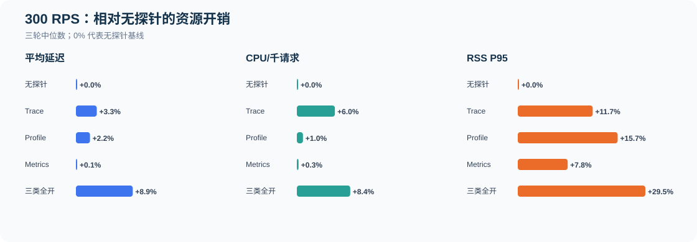
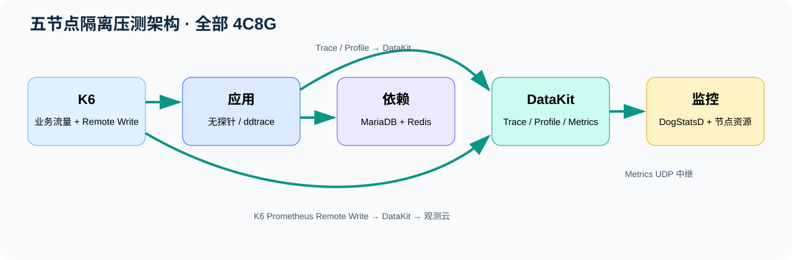
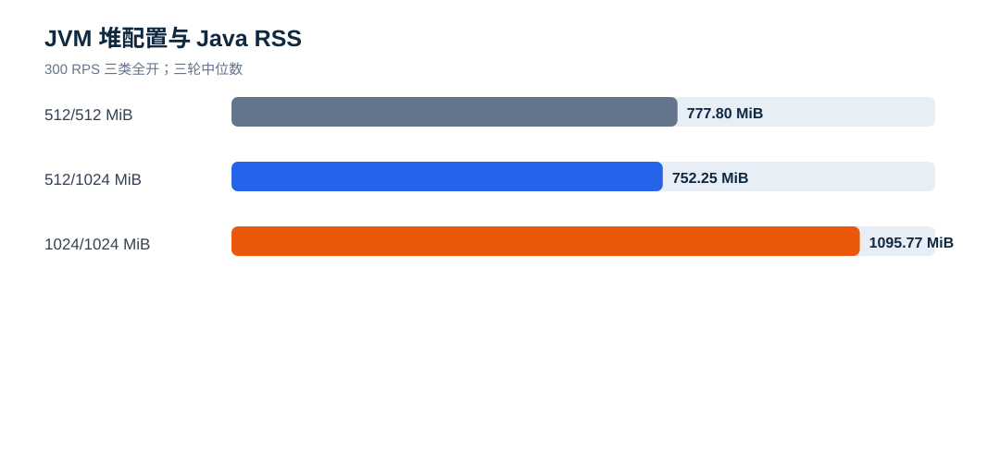
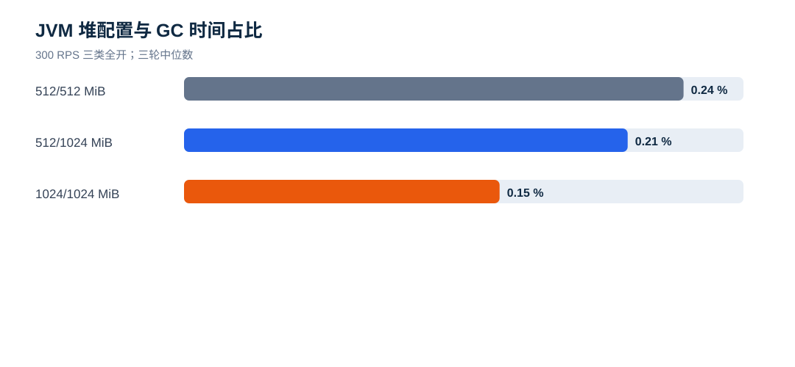
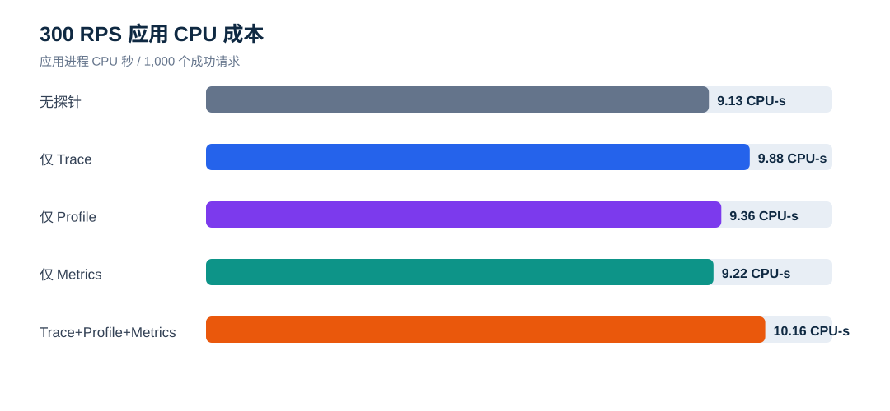
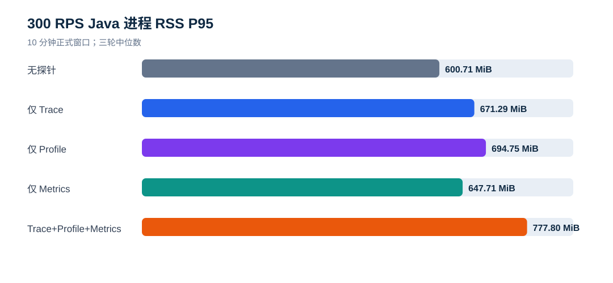
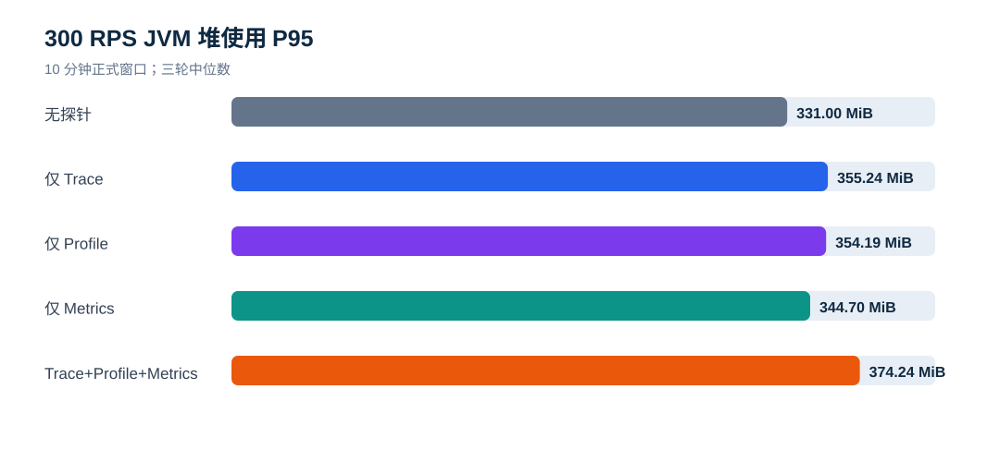
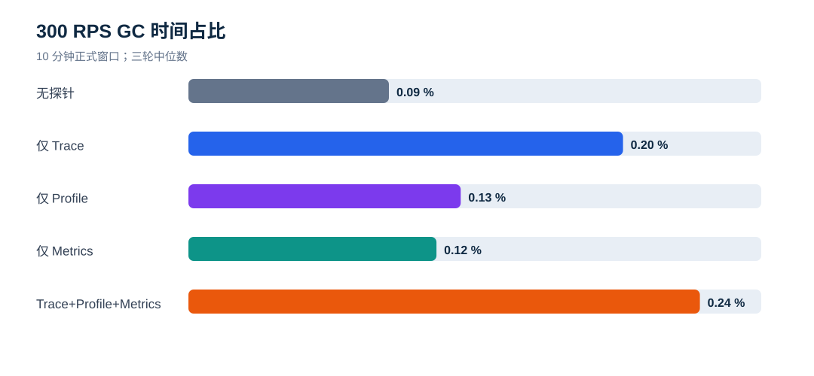
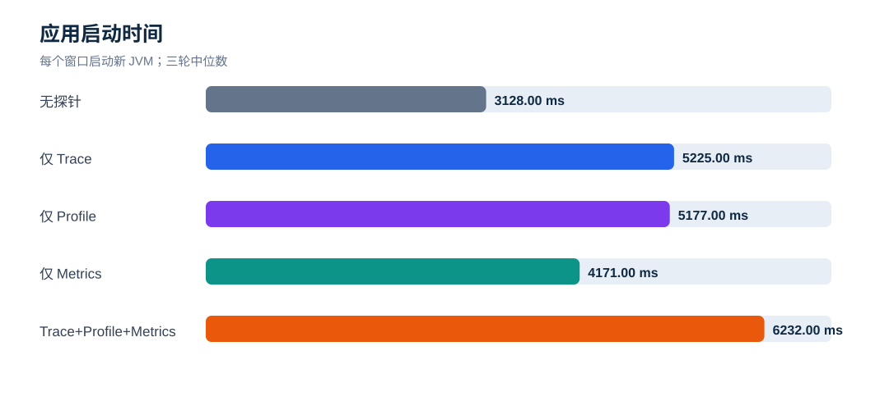

# ddtrace Trace / Profile / Metrics K6 10 分钟压测报告

**执行日期：** 2026-09-16

**测试对象：** 观测云 ddtrace Java Agent 与无探针基线

**正式窗口：** 主矩阵 30 个 + JVM 堆敏感性 12 个 = **42 个**，每窗 **600 秒**

**应用规格：** 4 vCPU / 8 GiB 云规格（OS 可见 7.54 GiB）；Temurin 8u504；G1GC

## 先看结论

1. **本报告使用 10 分钟正式窗口。** 100/300 RPS 共 30 个窗口用于持续资源和 GC 判断；500 RPS 的既有短测已出现约 24.5% 超时，不进入长测稳定容量结论。
2. **无探针 → 单项探针：开销不同。** 300 RPS 下 Metrics 的延迟影响最小；Profile 主要增加 RSS；Trace 主要增加 CPU 和延迟。具体比例见下方概览图。
3. **单项探针 → 三类全开：组合开销最高。** 三类全开相对无探针平均延迟 +8.9%、P95 +8.5%、CPU +8.4%、RSS P95 +177.1%；相对仅 Trace 再增加 1.96 ms 平均延迟和 106.5 MiB RSS。
4. **GC 仍在可控范围。** 300 RPS 三类全开 Young GC 中位数 411 次、Full GC 0 次，600 秒内累计停顿 1431 ms，占比 0.2385%，最大单次停顿中位数 26.06 ms。
5. **建议按场景启用。** 只需要 JVM/业务指标时优先 Metrics；需要链路追踪时单独启用 Trace 并预留约 6% CPU 和 70 MiB 以上 RSS；需要持续剖析时单独启用 Profile；只有确实需要三类数据同时采集时才全开，并按 RSS P95 约 778 MiB 和 CPU 增长 8.4% 预留余量。
6. **JVM 建议使用 `-Xms512m -Xmx1024m`。** 当前三类全开负载下仍只提交 512 MiB，RSS P95 752.2 MiB；固定 1 GiB 会让 RSS P95 增加约 318 MiB，虽然 GC 占比下降，但 P95 三轮范围重叠，未证明有稳定业务性能收益。

## 一、资源与内存分配

| 层级 | 配置/指标 | 含义 |
|---|---:|---|
| 云主机 | 4 vCPU / 8 GiB / 100 GiB ESSD PL0 | 应用节点系统资源；其余四个角色节点同规格 |
| 操作系统可见内存 | 7,910,376 KiB（约 7.54 GiB） | 云规格标称 8 GiB；报告中的占比按 8 GiB 表述 |
| 主矩阵 JVM 堆 | Xms 512 MiB / Xmx 512 MiB | 启动即提交 512 MiB，作为小堆统一对照 |
| GC | G1GC | 每窗从正式负载开始按 1 秒采样，并截取同时间段 GC 日志 |
| Java RSS | 见下表 | JVM 整个进程实际物理内存，不等于堆 |
| 系统使用内存 | 见 CSV | `/proc/meminfo` 的 MemTotal−MemAvailable，包含操作系统和节点其他进程 |

## 二、JVM 堆大小是否合理

### 三类全开

| Xms/Xmx | 模式 | P95（范围） | CPU/千请求 | RSS P95 | 堆 P95 / 峰值 | 已提交堆 | Young / Full GC | GC占比 |
|---|---|---:|---:|---:|---:|---:|---:|---:|
| 512/512 MiB | Trace+Profile+Metrics | 43.23 ms（42.42–43.90） | 9.438 CPU-s | 777.8 MiB | 374.2 / 394.5 MiB | 512 MiB | 411 / 0 | 0.2385% |
| 512/1024 MiB | Trace+Profile+Metrics | 42.78 ms（42.30–43.38） | 9.395 CPU-s | 752.2 MiB | 366.4 / 383.4 MiB | 512 MiB | 409 / 0 | 0.2118% |
| 1024/1024 MiB | Trace+Profile+Metrics | 41.95 ms（41.77–43.47） | 9.355 CPU-s | 1095.8 MiB | 646.6 / 680.3 MiB | 1024 MiB | 207 / 0 | 0.1507% |

### 无探针对照

| Xms/Xmx | 模式 | P95（范围） | CPU/千请求 | RSS P95 | 堆 P95 / 峰值 | 已提交堆 | Young / Full GC | GC占比 |
|---|---|---:|---:|---:|---:|---:|---:|---:|
| 512/512 MiB | 无探针 | 39.86 ms（39.78–39.98） | 8.709 CPU-s | 600.7 MiB | 331.0 / 348.6 MiB | 512 MiB | 257 / 0 | 0.0935% |
| 512/1024 MiB | 无探针 | 39.70 ms（39.70–39.85） | 8.682 CPU-s | 596.5 MiB | 331.7 / 347.5 MiB | 512 MiB | 257 / 0 | 0.0937% |
| 1024/1024 MiB | 无探针 | 39.73 ms（39.70–39.83） | 8.661 CPU-s | 914.1 MiB | 620.2 / 649.5 MiB | 1024 MiB | 129 / 0 | 0.0558% |

`Xms512m/Xmx1024m` 的三轮中，G1 最大已提交堆始终为 512 MiB，说明当前负载没有触发扩堆；它的价值是保留突发余量，不是降低当前 GC。固定 1 GiB 将综合模式 Young GC 从 411 次降至 207 次，GC时间占比从 0.2385% 降至 0.1507%，但 RSS 多使用 318.0 MiB；P95 范围分别为 42.42–43.90 ms 与 41.77–43.47 ms，区间重叠。

## 三、300 RPS 性能与资源影响

| 模式 | 成功请求 | 平均延迟 | P95 | CPU/千请求 | RSS P95 | 堆 P95 |
|---|---:|---:|---:|---:|---:|---:|
| 无探针 | 180,001 | 34.77 ms | 39.86 ms | 8.709 CPU-s | 600.7 MiB | 331.0 MiB |
| 仅 Trace | 180,001 | 35.90 ms | 41.72 ms | 9.228 CPU-s | 671.3 MiB | 355.2 MiB |
| 仅 Profile | 180,001 | 35.53 ms | 40.24 ms | 8.792 CPU-s | 694.7 MiB | 354.2 MiB |
| 仅 Metrics | 180,001 | 34.82 ms | 40.23 ms | 8.732 CPU-s | 647.7 MiB | 344.7 MiB |
| Trace+Profile+Metrics | 180,001 | 37.86 ms | 43.23 ms | 9.438 CPU-s | 777.8 MiB | 374.2 MiB |

| 模式 | CPU/千请求 | CPU 增幅 | RSS P95 | RSS 增量 | 堆 P95 | 堆增量 |
|---|---:|---:|---:|---:|---:|---:|
| 无探针 | 8.709 CPU-s | +0.0% | 600.7 MiB | +0.0 MiB | 331.0 MiB | +0.0 MiB |
| 仅 Trace | 9.228 CPU-s | +6.0% | 671.3 MiB | +70.6 MiB | 355.2 MiB | +24.2 MiB |
| 仅 Profile | 8.792 CPU-s | +1.0% | 694.7 MiB | +94.0 MiB | 354.2 MiB | +23.2 MiB |
| 仅 Metrics | 8.732 CPU-s | +0.3% | 647.7 MiB | +47.0 MiB | 344.7 MiB | +13.7 MiB |
| Trace+Profile+Metrics | 9.438 CPU-s | +8.4% | 777.8 MiB | +177.1 MiB | 374.2 MiB | +43.2 MiB |

## 四、GC 情况

### 300 RPS

| 模式 | Young GC | Full GC | GC 总停顿 | 时间占比 | 最大停顿 | Old Gen 首→尾 |
|---|---:|---:|---:|---:|---:|---:|
| 无探针 | 257 | 0 | 561 ms | 0.0935% | 19.71 ms | 0.0→43.2 MiB |
| 仅 Trace | 411 | 0 | 1216 ms | 0.2027% | 31.48 ms | 24.8→69.4 MiB |
| 仅 Profile | 258 | 0 | 762 ms | 0.1270% | 20.74 ms | 15.3→67.6 MiB |
| 仅 Metrics | 258 | 0 | 694 ms | 0.1157% | 17.94 ms | 13.4→57.2 MiB |
| Trace+Profile+Metrics | 411 | 0 | 1431 ms | 0.2385% | 26.06 ms | 27.0→87.9 MiB |

### 100 RPS

| 模式 | Young GC | Full GC | GC 总停顿 | 时间占比 | 最大停顿 | Old Gen 首→尾 |
|---|---:|---:|---:|---:|---:|---:|
| 无探针 | 87 | 0 | 194 ms | 0.0323% | 24.94 ms | 0.0→29.1 MiB |
| 仅 Trace | 139 | 0 | 419 ms | 0.0698% | 16.87 ms | 25.8→55.3 MiB |
| 仅 Profile | 86 | 0 | 299 ms | 0.0498% | 14.87 ms | 13.1→45.3 MiB |
| 仅 Metrics | 86 | 0 | 292 ms | 0.0487% | 11.42 ms | 18.0→40.0 MiB |
| Trace+Profile+Metrics | 138 | 0 | 452 ms | 0.0753% | 15.50 ms | 28.0→58.9 MiB |

GC 次数和累计时间只统计 600 秒正式业务窗口，不含 JVM 启动、10 秒预热和遥测排空。Old Gen 首尾值受采样落在 GC 周期中的位置影响，不能单独作为内存泄漏证据；应结合三轮范围、Full GC、堆 P95/峰值和更长 soak test 判断。

## 五、100 RPS 性能与资源影响

| 模式 | 成功请求 | 平均延迟 | P95 | CPU/千请求 | RSS P95 | 堆 P95 |
|---|---:|---:|---:|---:|---:|---:|
| 无探针 | 60,001 | 29.13 ms | 29.63 ms | 7.982 CPU-s | 573.0 MiB | 317.8 MiB |
| 仅 Trace | 60,000 | 29.40 ms | 29.97 ms | 8.556 CPU-s | 654.7 MiB | 344.7 MiB |
| 仅 Profile | 60,001 | 29.59 ms | 29.74 ms | 8.136 CPU-s | 686.1 MiB | 331.9 MiB |
| 仅 Metrics | 60,001 | 29.13 ms | 29.65 ms | 8.030 CPU-s | 621.9 MiB | 327.6 MiB |
| Trace+Profile+Metrics | 60,001 | 29.44 ms | 30.03 ms | 8.687 CPU-s | 727.4 MiB | 348.5 MiB |

| 模式 | CPU/千请求 | CPU 增幅 | RSS P95 | RSS 增量 | 堆 P95 | 堆增量 |
|---|---:|---:|---:|---:|---:|---:|
| 无探针 | 7.982 CPU-s | +0.0% | 573.0 MiB | +0.0 MiB | 317.8 MiB | +0.0 MiB |
| 仅 Trace | 8.556 CPU-s | +7.2% | 654.7 MiB | +81.7 MiB | 344.7 MiB | +26.9 MiB |
| 仅 Profile | 8.136 CPU-s | +1.9% | 686.1 MiB | +113.1 MiB | 331.9 MiB | +14.1 MiB |
| 仅 Metrics | 8.030 CPU-s | +0.6% | 621.9 MiB | +48.9 MiB | 327.6 MiB | +9.8 MiB |
| Trace+Profile+Metrics | 8.687 CPU-s | +8.8% | 727.4 MiB | +154.4 MiB | 348.5 MiB | +30.7 MiB |

## 六、应用启动时间

启动时间从每个窗口执行 `systemctl start` 开始，到应用健康检查接口 `/dms2/health` 返回成功结束；不包含预热、正式业务请求和遥测排空。每个窗口都会重新启动 JVM，因此该指标反映探针加载和应用启动阶段的额外耗时。

| 模式 | 100 RPS 启动时间中位数（范围） | 300 RPS 启动时间中位数（范围） |
|---|---:|---:|
| 无探针 | 3131 ms（3114–3140） | 3118 ms（3115–3135） |
| 仅 Trace | 5234 ms（5227–6246） | 5239 ms（5235–5244） |
| 仅 Profile | 5186 ms（5165–5186） | 5179 ms（5178–5203） |
| 仅 Metrics | 4180 ms（4177–4183） | 4175 ms（4170–4183） |
| Trace+Profile+Metrics | 6222 ms（6202–6269） | 6225 ms（6209–6265） |

以 300 RPS 窗口为例，无探针启动中位数为 3118 ms；仅 Metrics、仅 Profile、仅 Trace 和三类全开分别为 4175 ms、5179 ms、5239 ms 和 6225 ms。三类全开比无探针增加约 3107 ms。

## 七、测试步骤与统计口径

每窗均重新启动 JVM → 50 RPS 预热 10 秒 → 等待遥测桶切换并重置审计计数 → K6 `constant-arrival-rate` 持续 600 秒 → 等待业务请求清零 → Trace 队列排空 25 秒 → 停止 JVM → Profile 上传等待 15 秒 → 保存五节点资源、JVM/GC、DataKit 和 Agent 健康指标。100/300 RPS 的顺序按轮次交替，表格使用三轮中位数，明细 CSV 保留最小值和最大值。

## 八、500 RPS 为什么不做 10 分钟

此前 90 秒边界测试中，各模式约 24.5% 请求超时，主要为 K6 1050 请求超时，少量 1211 TCP 建连超时；应用基线本身已经失稳。继续维持 10 分钟只会重复无效饱和状态，无法公平归因 Agent 开销。因此本轮长测只覆盖已验证可稳定完成的 100/300 RPS。

## 九、遥测完整性

- Trace：综合模式按 Agent 创建、入队、flush、API 请求/响应和明确丢弃核对；仅 Trace 因 1.65.6-ext 健康指标与 runtime metrics 绑定，使用 DataKit 接收增量和错误日志核对。
- Profile：逐窗核对 `/v1/upload/profiling` 成功计数与 profiling points。
- Metrics：逐窗核对 StatsD 点、JVM 指标族和 UDP 解码错误。
- K6：每窗通过 Prometheus Remote Write 上报；观测云按三个 `benchmark_id` 和独立 `testid` 回溯到主矩阵 30 个、堆敏感性 12 个，共 **42 个窗口**，失败率均为 0。

## 十、限制

- 10 分钟可观察持续负载下的 GC、堆高水位和短期内存趋势，仍不能代替数小时级内存泄漏或容量 soak test。
- 结论只适用于本应用、waterfall 接口、Temurin 8u504、Agent 1.65.6-ext 和 4C8G 单应用节点。
- RSS 包含 JVM 堆外与 Agent 原生开销；堆与 RSS 不应相加。

## 十一、交付文件

- `data/window-results.csv`：30 个 10 分钟窗口明细；
- `data/summary.csv`：10 个模式/负载组合的三轮中位数与范围；
- `data/heap-sensitivity.csv`：18 个 JVM 堆对比窗口明细，其中 6 个复用主矩阵、12 个为新增敏感性窗口；
- `data/validation.json`：自动完整性校验；
- `dashboard/ddtrace-k6-replay.json`：观测云 K6 回溯仪表板；
- `owl-reports/`：脱敏查询证据。
