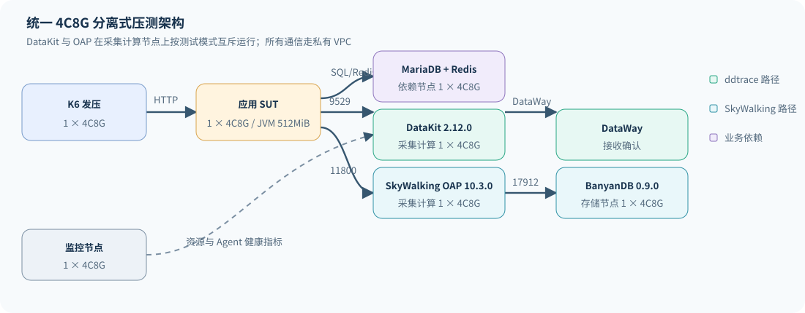

# K6 压测架构与资源清单

**区域：华东2（上海）｜统一规格：4 vCPU / 8 GiB｜适用范围：ddtrace 与 SkyWalking Java Agent 对比**

## 一、架构结论

机器需要分离。K6、应用、数据库、采集计算和存储共享机器时，任一组件的 CPU、内存、网卡或连接池争抢都会混入 Agent 开销。本次实际使用 6 个 4C8G 资源单元；容量不足时增加同规格实例，不提升为 16C64G 或 32C128G 单机。

DataKit 与 OAP 位于同一采集计算节点，但按测试模式互斥运行：ddtrace 模式只运行 DataKit，SkyWalking 模式只运行 OAP。BanyanDB 独占存储节点。应用 JVM 一次只加载一种 Agent。

## 二、实际资源清单

|角色|数量|规格|磁盘|职责与隔离要求|
|---|---:|---|---|---|
|K6 发压|1|4C8G|100 GB ESSD PL0|只负责开放模型发压；主机 CPU 持续值应低于80%|
|应用 SUT|1|4C8G|100 GB ESSD PL0|三种 Agent 串行 A/B；JVM 固定 512 MiB 堆|
|依赖|1|4C8G|100 GB ESSD PL0|MariaDB 与 Redis 合并；不与应用、K6混部|
|采集计算|1|4C8G|100 GB ESSD PL0|DataKit 2.12.0 或 OAP 10.3.0，互斥运行|
|存储|1|4C8G|100 GB ESSD PL0|BanyanDB 0.9.0 Standalone，保留完整测试数据|
|监控|1|4C8G|100 GB ESSD PL0|DogStatsD Health Metrics 和六节点秒级监控|

合计：**6 台、24 vCPU、48 GiB、600 GB 系统盘**。

## 三、端口与数据路径

|流向|端口/协议|本轮用途|
|---|---|---|
|K6 → 应用|19106/TCP HTTP|业务请求|
|应用 → DataKit|9529/TCP HTTP|ddtrace `/v0.4/traces` 上报|
|应用 → OAP|11800/TCP gRPC|SkyWalking Segment 上报|
|OAP 查询|12800/TCP HTTP|GraphQL 查询 BanyanDB 持久化 Trace|
|OAP → BanyanDB|17912/TCP gRPC|存储写入与查询|
|Agent → 监控|18125/UDP DogStatsD|ddtrace 队列、flush、API响应与发送耗时|
|监控查询|19531/TCP HTTP|每轮重置和读取 Agent 健康指标|

所有服务间流量走私有 VPC。安全组仅允许测试 VPC 内部互通和操作者地址 SSH，公网只用于软件安装及遥测外送。

## 四、K6 执行矩阵

K6 使用 `constant-arrival-rate`，正常模型包含真实 MariaDB/Redis 调用和显式等待。正式矩阵如下：

|模式|目标 RPS|单轮时长|重复|窗口数|
|---|---|---:|---:|---:|
|无探针|100、300、500|45秒|每档3轮|9|
|Datadog ddtrace 1.65.0|100、300、500|45秒|每档3轮|9|
|观测云 ddtrace 1.65.6-ext|100、300、500|45秒|每档3轮|9|
|SkyWalking Java Agent 9.7.0|100、300、500|45秒|每档3轮|9|

每轮先以 50 RPS 预热 10 秒。ddtrace 在正式流量后保留 25 秒排空，SkyWalking 保留 15 秒；监控窗口覆盖业务流量及异步外送尾部。三个重复轮次轮换速率顺序，降低固定顺序偏差。

轻量参数场景在依赖分离后无探针单请求即因连接池返回 HTTP 500，不满足基线可用条件，因此作为失败探测记录，不进入正式 Agent 对比。

## 五、通过标准

业务通过与遥测完整通过分开判断：

|层次|通过条件|
|---|---|
|K6|成功 RPS 达到目标95%；HTTP失败0；`dropped_iterations=0`|
|应用|活动请求在规定时间内归零；日志无 OOM 或发送异常|
|ddtrace Agent|`queue.dropped.traces/spans=0`；入队与 flush 对账；API错误0|
|DataKit/DataWay|接收Span与Agent入队Span边界差在1.5%内；feed 与 DataWay OK 边界差在1.5%内；队列不持续增长|
|SkyWalking|OAP可用；按主测精确时间窗从 BanyanDB 查询到的业务Trace达到99%|
|资源|K6主机 CPU 不持续超过80%；关键后端 CPU 不持续超过70%，内存无单调增长|

## 六、生产扩展建议

本轮 `1×4C8G OAP + 1×4C8G BanyanDB Standalone` 是常规起测配置，不具备高可用。生产环境应把 BanyanDB 改为 Liaison/Data 集群，并保持每个实例 4C8G；当 CPU 持续超过70%、内存超过80%、磁盘超过70%、写入队列持续增长或查询 P95 超标时，增加同规格实例后重测。

本轮事后批量拉取完整 Trace 时，单机 4C8G OAP/BanyanDB 出现过 503 和节点重启，缩小到业务接口与单窗口分页后才完成对账。因此 4C8G 可以作为单组件起步规格，持续大范围检索应使用更多同规格实例并单独验证查询容量。SkyWalking 500 RPS 场景的 K6 主机还出现约97%的秒级瞬时 CPU 峰值；窗口平均约4%且没有丢弃迭代，但长稳测试若出现持续峰值，应增加到 2 台或更多 4C8G K6 节点。

SkyWalking 官方 standard benchmark 使用 32C128G Kubernetes 宿主机，同时给 Liaison 和 Data 单 Pod 分配 4C8G。因此官方文档中的 4C8G 是组件资源单元，不能理解为整套 OAP/BanyanDB 只需一台 4C8G。[BanyanDB 混合场景基准](https://skywalking.apache.org/docs/skywalking-banyandb/latest/operation/benchmark/benchmark-hybrid/)

短时窗口通过后，生产容量验证还应增加 60 分钟稳态、至少5轮重复、8–24小时耐久、持续Trace查询、DataKit/OAP重启、网络延迟和后端不可用恢复测试。
