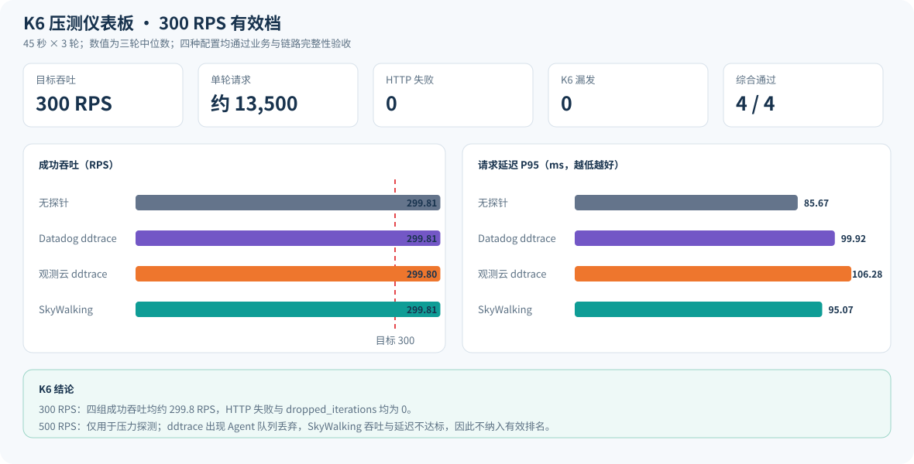
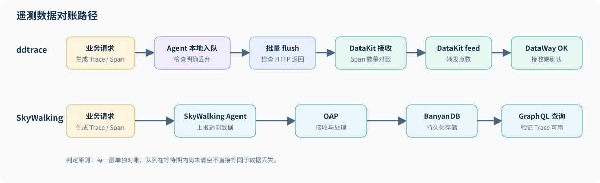
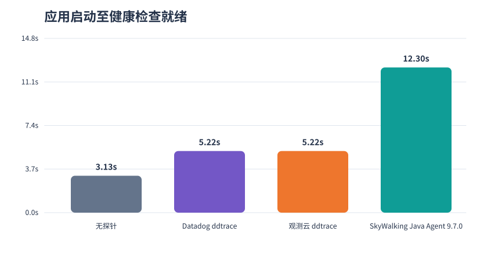

# ddtrace 与 SkyWalking K6 全面压测报告

配套材料：[HTML 报告](K6全面压测报告.html)｜[交互式 K6 仪表板](K6压测仪表板.html)｜[管理摘要](最终压测总结.md)｜[压测架构与资源清单](K6压测架构与资源清单.md)｜[12 组汇总数据](data/summary.csv)｜[36 个窗口明细](data/runs.csv)

**执行日期：2026-09-15｜区域：上海｜36 个正式窗口｜每档 45 秒 × 3 轮｜全部节点统一 4C8G**

> **数据校验：通过。** 36 个正式窗口均完成请求量、业务结果和遥测数据对账。ddtrace 按 Agent 入队、明确丢弃、HTTP 返回、DataKit 接收和 DataWay 接受五层统计；SkyWalking 通过 OAP 查询 BanyanDB 中实际持久化的 Trace。

## 先看结论

> **本轮结论：在当前接口、Span数量和统一4C8G分离部署条件下，四组在300 RPS短时测试中都同时满足业务成功和链路完整要求；500 RPS不能作为共同可用档位。建议用300 RPS开始下一阶段60分钟稳态测试。**

> **选型结论：常规体量、重视部署成本和启动速度时，优先选择 ddtrace；重视300 RPS下更低的业务P95，且能够接受更高后端内存和更长启动时间时，可选择 SkyWalking。基于本次综合表现，推荐 ddtrace 作为常规用户默认方案。**

推荐 ddtrace 的依据是：300 RPS 下业务与链路完整性均通过；应用启动时间为5.22秒，SkyWalking为12.30秒；DataKit进程峰值内存约452–461 MiB，SkyWalking的OAP约2,085 MiB且还需要约465 MiB的BanyanDB。SkyWalking的优势是300 RPS下P95为95.07 ms，优于Datadog ddtrace的99.92 ms和观测云ddtrace的106.28 ms。500 RPS下ddtrace虽然保持业务吞吐，但发生Agent队列丢弃；SkyWalking则出现业务吞吐和延迟失败，因此两者均不能按当前配置承诺500 RPS。

这里的 **300 RPS** 是 K6 每秒调用约300次 `POST /app/shoppingCart/list`，45秒约发起13,500次请求。它不是 300 个用户，也不是整个系统的生产容量上限。换算用户数时还要知道每个用户多久请求一次：如果每个用户每秒调用1次，约等于300个同时活跃用户；如果每5秒调用1次，约等于1,500个同时活跃用户。

### 300 RPS 有效结果

|方案|成功吞吐|平均延迟|P95|应用CPU成本|链路完整性|结论|
|---|---:|---:|---:|---:|---|---|
|无探针|299.81 RPS|44.72 ms|85.67 ms|9.80 CPU秒/千请求|不适用|通过|
|Datadog ddtrace 1.65.0|299.81 RPS|49.74 ms|99.92 ms|10.56 CPU秒/千请求|无明确丢弃；DataKit/DataWay对账约100%|通过|
|观测云 ddtrace 1.65.6-ext|299.80 RPS|54.61 ms|106.28 ms|10.79 CPU秒/千请求|无明确丢弃；DataKit/DataWay对账约100%|通过|
|SkyWalking Java Agent 9.7.0|299.81 RPS|49.56 ms|95.07 ms|10.66 CPU秒/千请求|BanyanDB可查询Trace 100%|通过|

### 为什么 500 RPS 不作为有效结论

500 RPS 已经实际执行，但它只用于寻找压力拐点。三种探针方案没有同时满足业务成功和链路完整要求，因此报告不使用该档位进行性能排名。

|方案|500 RPS 现象|不通过原因|
|---|---|---|
|Datadog ddtrace 1.65.0|业务吞吐接近500 RPS|Agent本地队列明确丢弃Trace中位数60.05%|
|观测云 ddtrace 1.65.6-ext|业务吞吐接近500 RPS|Agent本地队列明确丢弃Trace中位数67.61%|
|SkyWalking Java Agent 9.7.0|成功吞吐266.11 RPS，P95约10.48秒|未达到目标吞吐，且出现6,000次HTTP失败|

“业务通过”指成功RPS达到目标95%、HTTP失败为0且K6没有漏发；“链路完整”指ddtrace没有Agent明确队列丢弃并完成DataKit/DataWay对账，或SkyWalking业务Trace可以从BanyanDB查询。任意一项不满足，综合结果就是不通过。

## K6 压测仪表板

[打开交互式 K6 仪表板](K6压测仪表板.html)，可以切换查看 100、300 和 500 RPS。仪表板默认显示300 RPS；500 RPS页面明确标为压力探测失败档。

## 一、背景与目标

本次测试同时统计业务表现和遥测完整性。ddtrace 的 `RemoteWriter` 使用异步队列，只有 `queue.dropped.*`、发送错误或接收/落盘闭环缺口才计为数据丢失。测试主要回答四个问题：

1. 三种 Java Agent 对业务吞吐、平均/P95/P99 延迟、CPU、内存和启动时间的影响；
2. ddtrace 是否发生明确队列丢弃，DataKit 9529 是否接收，DataWay 是否接受；
3. SkyWalking Agent → OAP → BanyanDB 的 Trace 是否可以查询；
4. 在常规用户规格下，4C8G 单元应如何拆分以及已测容量边界在哪里。

测试方法参考 [SkyWalking Agent Benchmarks](https://skyapmtest.github.io/Agent-Benchmarks/) 的无探针基线对照思路，但应用、依赖、Agent版本、负载和后端均为本次独立环境，不能直接横比其历史数值。

## 二、资源与架构

### 2.1 实际开通资源

|角色|数量|统一规格|主要软件与职责|
|---|---:|---|---|
|K6 发压|1|4C8G，100 GB ESSD PL0|k6 v2.2.0，固定到达率发压|
|应用 SUT|1|4C8G，100 GB ESSD PL0|JDK 8u265，固定 512 MiB 堆；一次只加载一个 Agent|
|依赖|1|4C8G，100 GB ESSD PL0|MariaDB 与 Redis；不与应用混部|
|采集计算|1|4C8G，100 GB ESSD PL0|DataKit 2.12.0 或 OAP 10.3.0；二者按场景互斥运行|
|存储|1|4C8G，100 GB ESSD PL0|BanyanDB 0.9.0 Standalone|
|监控|1|4C8G，100 GB ESSD PL0|ddtrace Health Metrics、六节点秒级资源窗口|

合计 **6 台、24 vCPU、48 GiB、600 GB 系统盘**。MySQL 与 Redis 合并在依赖节点，其余会影响结论的角色均分离。所有业务和遥测走同一私有 VPC，安全组只开放测试所需的内网流量。

SkyWalking 官方混合基准中的 standard 环境使用 32C128G Kubernetes 宿主机，同时把 Liaison 和 Data 节点单 Pod 资源设为 4C8G。因此“4C8G”是组件资源单元，并不代表完整 SkyWalking 后端只需一台 4C8G。本轮按常规体量采用 1 个 4C8G OAP 加 1 个 4C8G BanyanDB Standalone；它用于观察单实例边界，不是高可用生产方案。[官方 BanyanDB 混合基准](https://skywalking.apache.org/docs/skywalking-banyandb/latest/operation/benchmark/benchmark-hybrid/)

### 2.2 软件和关键配置

|组件|版本/配置|
|---|---|
|Datadog Agent|dd-trace-java 1.65.0，全量采样|
|观测云 Agent|ddtrace 1.65.6-ext，全量采样|
|SkyWalking|Java Agent 9.7.0、OAP 10.3.0、BanyanDB 0.9.0|
|DataKit|2.12.0，监听 `0.0.0.0:9529`，DataWay WAL 上限 2 GB|
|JVM|JDK 8u265，`-Xms512m -Xmx512m`，可用 4 CPU|
|负载|正常模型：真实 MariaDB/Redis 调用与显式等待；100/300/500 RPS|

DataKit 的 ddtrace 接收端口 9529 与 DogStatsD 端口用途不同，本轮应用确实通过私网访问 `collector-node:9529`。[DataKit DDTrace 接入说明](https://docs.guance.com/en/integrations/ddtrace/)

## 三、步骤与统计口径

每个正式窗口都执行以下流程：启动全新 JVM并计时至健康检查成功；以 50 RPS 预热 10 秒；确认活动请求归零；重置 Agent 健康指标；启动六节点秒级监控；以 K6 `constant-arrival-rate` 发压 45 秒；等待应用请求排空；ddtrace 额外等待 25 秒、SkyWalking 等待 15 秒；抓取采集端指标、日志和资源数据。三个重复轮次采用 100→300→500、500→300→100、300→100→500 的顺序。

K6 使用开放模型，因此 `dropped_iterations` 表示发压器因 VU 不足而未能生成的迭代；HTTP 失败与业务成功分开统计。下表中的值为三轮中位数，括号为最小–最大。应用 CPU 成本按“主测开始到发送排空结束”的进程 CPU 秒除以业务请求数归一化。

遥测对账路径如下。每一层独立计数，避免把异步队列中的暂存数据误判为丢失。

## 四、现象与结果

### 4.1 300 RPS 业务吞吐与延迟

|配置|成功RPS（范围）|平均延迟ms（范围）|P95 ms（范围）|P99 ms|CPU秒/千请求|峰值RSS MiB|HTTP失败|K6丢弃|
|---|---|---|---|---|---|---|---|---|
|无探针|299.81（299.81–299.82）|44.72（43.34–55.35）|85.67（77.43–102.60）|143.27|9.80|591.79|0|0|
|Datadog ddtrace 1.65.0|299.81（299.79–299.81）|49.74（49.35–51.86）|99.92（99.16–112.29）|150.50|10.56|667.72|0|0|
|观测云 ddtrace 1.65.6-ext|299.80（299.79–299.80）|54.61（51.87–54.69）|106.28（104.51–116.18）|160.62|10.79|662.77|0|0|
|SkyWalking Java Agent 9.7.0|299.81（299.80–299.81）|49.56（47.91–50.74）|95.07（87.08–97.93）|132.84|10.66|679.49|0|0|

按“成功 RPS ≥ 目标的95%、HTTP失败为0、K6丢弃为0”的业务标准，各配置已测最高通过档位为：无探针 500 RPS; Datadog ddtrace 1.65.0 500 RPS; 观测云 ddtrace 1.65.6-ext 500 RPS; SkyWalking Java Agent 9.7.0 300 RPS。四组共同业务通过的最高档位是 **300 RPS**。再加入 Trace 明确丢弃、DataKit/DataWay 闭环和 BanyanDB 可查询条件后，各配置综合通过档位为：无探针 500 RPS; Datadog ddtrace 1.65.0 300 RPS; 观测云 ddtrace 1.65.6-ext 300 RPS; SkyWalking Java Agent 9.7.0 300 RPS；四组共同综合通过的最高档位是 **300 RPS**。这里是 45 秒短时窗口结论，不能替代 1 小时稳态和 8–24 小时耐久测试。

### 4.2 300 RPS 相对无探针基线的开销

|配置|平均延迟增量ms|P95增量ms|CPU秒/千请求增量|峰值RSS增量MiB|
|---|---|---|---|---|
|Datadog ddtrace 1.65.0|5.02|14.25|0.76|75.93|
|观测云 ddtrace 1.65.6-ext|9.89|20.60|1.00|70.98|
|SkyWalking Java Agent 9.7.0|4.84|9.40|0.86|87.70|

300 RPS 下，Datadog 原版、观测云 ddtrace、SkyWalking 的 P95 相对基线增加分别为 **14.25 ms、20.60 ms、9.40 ms**。

### 4.3 应用加载探针后的启动时间

|配置|启动样本|中位秒|最小–最大秒|相对基线增加秒|
|---|---|---|---|---|
|无探针|9|3.13|3.11–3.14|0.00|
|Datadog ddtrace 1.65.0|9|5.22|5.18–5.26|2.09|
|观测云 ddtrace 1.65.6-ext|9|5.22|5.18–5.22|2.09|
|SkyWalking Java Agent 9.7.0|9|12.30|12.29–12.35|9.17|

启动时间从 `systemctl start` 前的毫秒时间戳计到健康检查首次成功。健康检查按 1 秒轮询，因此单次值约有 0–1 秒向上误差；所有配置流程一致，可以做组间比较。

### 4.4 300 RPS 分离节点资源占用

|配置|应用CPU均值%|K6 CPU均值%|K6 CPU峰值%|依赖CPU均值%|采集CPU均值%|采集CPU峰值%|采集进程RSS峰值MiB|存储CPU均值%|存储进程RSS峰值MiB|
|---|---|---|---|---|---|---|---|---|---|
|无探针|60.32|1.66|5.00|3.71|0.09|1.25|0.00|0.21|172.88|
|Datadog ddtrace 1.65.0|46.73|1.14|5.72|2.75|3.68|9.52|452.61|0.20|174.88|
|观测云 ddtrace 1.65.6-ext|47.78|0.98|4.77|2.75|4.05|10.22|461.48|0.21|174.88|
|SkyWalking Java Agent 9.7.0|54.12|1.17|5.74|3.17|2.61|6.98|2085.02|0.63|465.31|

CPU百分比以整台4核主机为100%。无探针时采集节点停用 DataKit/OAP；ddtrace 时运行 DataKit；SkyWalking 时运行 OAP，BanyanDB 始终位于独立存储节点。K6 使用主机CPU统计，因为 K6 进程在窗口中创建并退出，进程累计计数不适合跨退出边界求差。

### 4.5 ddtrace 是否存在数据丢失

**Agent 队列与发送**

|配置|入队Trace|flush Trace|明确丢弃Trace|丢弃%|API请求/200/错误|发送P99 ms|
|---|---|---|---|---|---|---|
|Datadog ddtrace 1.65.0|13,556|13,556|0|0.00|92/92/0|2.52|
|观测云 ddtrace 1.65.6-ext|13,560|13,560|0|0.00|93/93/0|2.58|

**DataKit 与 DataWay**

|配置|Agent入队Span|DataKit接收Span|接收/入队%|DataKit feed|DataWay OK|OK/feed%|结束队列点数|
|---|---|---|---|---|---|---|---|
|Datadog ddtrace 1.65.0|513,095|513,129|100.01|513,129|513,145|100.00|0|
|观测云 ddtrace 1.65.6-ext|513,099|513,136|100.01|513,136|513,152|100.00|2|

本轮两种 ddtrace 的最高明确队列丢弃率为 **68.79%**。是否存在丢失，以表中的明确丢弃、发送错误以及 DataKit/DataWay 闭环共同判断；不能再用“某一秒尚未到达”代替丢失结论。`RemoteWriter` 缓冲送出后会释放队列空间，但当生产速度持续高于序列化、批量发送、网络响应和接收端处理的综合消费速度时，非阻塞队列仍可能打满并明确丢弃新 Trace。

500 RPS 时，Datadog 原版和观测云 ddtrace 的明确队列丢弃率中位数分别为 **60.05%**、**67.61%**；但已入队 Span 到 DataKit 的比例分别为 **100.03%**、**100.04%**，Agent发送 P99 分别为 **2.64 ms**、**2.68 ms**，DataKit 节点CPU峰值分别为 **15.04%**、**13.72%**。这些指标共同用于判断反压位置。

**原因判断：500 RPS 的已入队 Span 基本全部进入 DataKit，Agent HTTP 全部成功，DataKit 窗口末值仅0–2点、未见持续积压，节点峰值 CPU 低于17%。因此本轮明确丢弃发生在 Agent 本地入队阶段，证据不支持“DataKit 接收慢”是主因；更细的 Agent 序列化、消费者调度或应用 CPU 竞争占比仍需 profiler 才能拆分。**

若高压档出现队列丢弃，而 DataKit 主机 CPU、结束队列/WAL、Agent发送耗时或 DataWay 接受同步升高，只能说明外送链路存在反压；是否由 DataKit 接收慢主导，需要结合这些指标判断，不能只凭 `RemoteWriter` 队列满直接归因。

### 4.6 SkyWalking OAP/BanyanDB 持久化

|业务完成|可查询Trace|Trace/业务%|可查询Span|OAP节点CPU%|BanyanDB节点CPU%|
|---|---|---|---|---|---|
|13,501|13,501|100.00|742,555|2.61|0.63|

SkyWalking 表格来自正式窗口结束后，通过 OAP GraphQL 按每轮精确毫秒时间范围查询 BanyanDB 的结果。它比“Agent已发送”更接近最终可用性，但本轮没有执行持续查询并发和索引延迟分位测试。

300 RPS 的三个正式窗口中，可查询业务 Trace 均与应用完成数逐轮相等。500 RPS 的持久化比例虽然仍为100%，但业务吞吐和延迟已经失败，具体原因统一列入下一节。

### 4.7 500 RPS 压力探测为何不通过

500 RPS 是已经执行的压力探测档，不是本报告推荐的运行档位：

1. **Datadog ddtrace：** 成功吞吐接近目标且HTTP失败为0，但Agent本地队列明确丢弃Trace中位数为 **60.05%**，链路完整性失败。
2. **观测云 ddtrace：** 成功吞吐接近目标且HTTP失败为0，但Agent本地队列明确丢弃Trace中位数为 **67.61%**，链路完整性失败。
3. **SkyWalking：** 成功吞吐中位数只有 **266.11 RPS**，出现 **6,000** 次HTTP失败，P95达到 **10.48 秒**，业务容量失败。

因此，500 RPS 的数据只用于说明瓶颈和扩容方向，不参与三种探针的有效性能排名。若要把500 RPS作为目标，需要先优化Agent队列/消费能力和应用处理能力，完成扩容后重新压测。

在大时间范围批量查询完整 Trace 时，OAP 出现 503，BanyanDB 实例发生重启；改为限定业务接口、按单个窗口分页后，9 个窗口均完成精确对账。该现象说明单机 4C8G OAP + 单机 4C8G BanyanDB 的大量明细查询余量有限。生产查询应限制时间范围和分页大小；持续高并发查询需横向增加同规格实例并单独压测。

### 4.8 被排除的轻量模型

轻量参数 `cpuMs=8&delayMs=0&payloadBytes=256&hotCalls=1000` 在依赖分离后，全新无探针 JVM 的单请求就返回 HTTP 500：`Could not get a resource from the pool`。因此它不满足基线可用条件，未进入正式对比，也没有用其失败结果评价任何 Agent。36 个正式窗口全部使用可对账的正常模型。

## 五、数据质量与限制

- 36 个正式窗口均保留 K6 汇总、应用计数、六节点资源、启动时间和日志审计；每个配置/档位 3 轮。
- 无HTTP失败的窗口要求应用完成数与K6请求数相等；发生客户端超时的压力窗口要求应用完成数位于“客户端成功数至已发请求数”之间。ddtrace Health Metrics 的 StatsD 解码错误必须为0。
- ddtrace 的 DataWay `OK` 是接收端确认指标，不等同于用户界面已完成所有索引；SkyWalking 则补做了 BanyanDB 可查询验证。
- 单档只有 45 秒，适合发现开销和短时拐点，不足以证明生产稳定容量；没有覆盖高可用、故障注入、跨服务传播、保留期磁盘增长、1小时稳态或24小时耐久。
- BanyanDB 采用 Standalone，OAP 与 DataKit 共用同一台 4C8G 但严格互斥运行；生产高可用应改为多个同规格实例。
- SkyWalking 500 RPS 场景因预分配大量 VU，K6 主机出现约97%的秒级瞬时 CPU 峰值，但窗口平均约4%且 `dropped_iterations=0`。若长稳测试仍出现持续高峰，应使用 2 台或更多 4C8G K6 节点分布式发压。

## 六、总结与建议

1. **常规用户默认推荐 ddtrace。** 300 RPS下两种ddtrace均通过，启动时间和本地采集后端内存明显低于SkyWalking；若采用观测云链路，使用观测云ddtrace。500 RPS前必须先解决Agent本地队列丢弃。
2. **SkyWalking适合能够承担更高后端资源的场景。** 它在300 RPS下P95最低且BanyanDB Trace对账100%，但启动时间更长，OAP+BanyanDB内存更高，500 RPS业务容量不通过。
3. **机器需要分离。** 本轮将 K6、应用、依赖、采集计算、存储、监控拆成 6 台统一 4C8G，避免把发压器、数据库或后端争抢误算成 Agent 开销。
4. **四组共同通过的最高短时测试档为 300 RPS。** 该值用于选择下一阶段长稳测试起点，不是生产容量承诺。
5. **ddtrace 丢失必须按五层证据判定。** 重点看 `queue.dropped.traces/spans`、Agent发送错误、DataKit接收Span、DataKit feed 和 DataWay OK；25秒排空只负责等待已入队数据。
6. **下一阶段应补稳态与容量测试。** 在当前架构上按300 RPS运行60分钟、重复至少5轮，再做8小时耐久；若目标是500 RPS，应先扩容或调优后重新测试。

## 七、参考资料

- [Apache SkyWalking BanyanDB 混合场景基准](https://skywalking.apache.org/docs/skywalking-banyandb/latest/operation/benchmark/benchmark-hybrid/)
- [Apache SkyWalking OAP 使用 BanyanDB](https://skywalking.apache.org/docs/main/latest/en/setup/backend/storages/banyandb/)
- [DataKit DDTrace 接入](https://docs.guance.com/en/integrations/ddtrace/)
- [Grafana k6 大规模测试建议](https://grafana.com/docs/k6/latest/testing-guides/running-large-tests/)
- [Grafana k6 分布式测试](https://grafana.com/docs/k6/latest/testing-guides/running-distributed-tests/)
- [SkyWalking Agent Benchmarks](https://skyapmtest.github.io/Agent-Benchmarks/)
